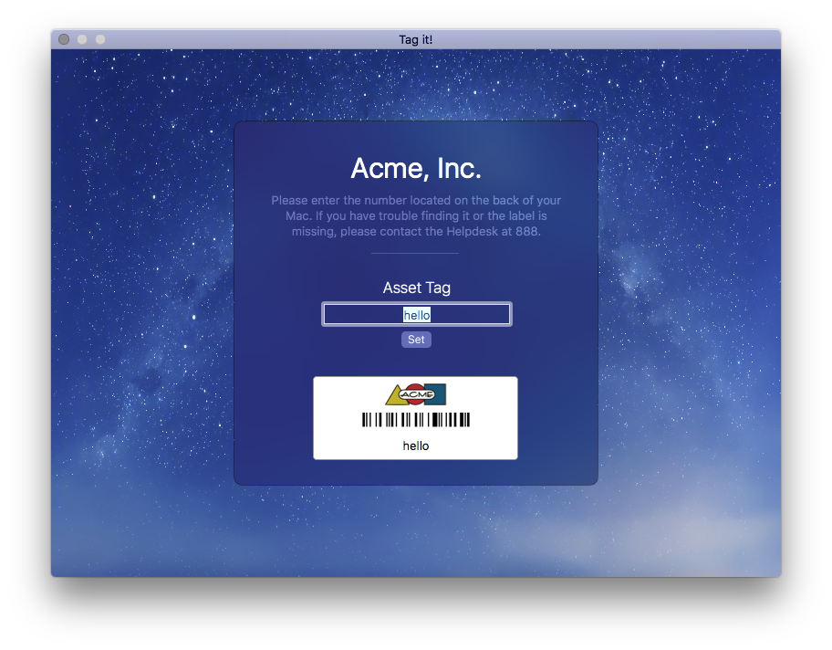

# Tagit

This app is a proof of concept for asking the user for the Asset tag of his Mac.

The barcode is dynamically generated with [CICode128BarcodeGenerator](https://developer.apple.com/library/prerelease/content/documentation/GraphicsImaging/Reference/CoreImageFilterReference/index.html#//apple_ref/doc/filter/ci/CICode128BarcodeGenerator). 

You can retrieve the asset tag with: 
`defaults read io.fti.Tagit assetTag`

Or set it via: 
`defaults write io.fti.Tagit assetTag hello`

Every time you launch the application, a different background is drawn from /Library/Desktop Pictures/

PR are most welcomed! Please mention me, extra publicity never hurts :-)
